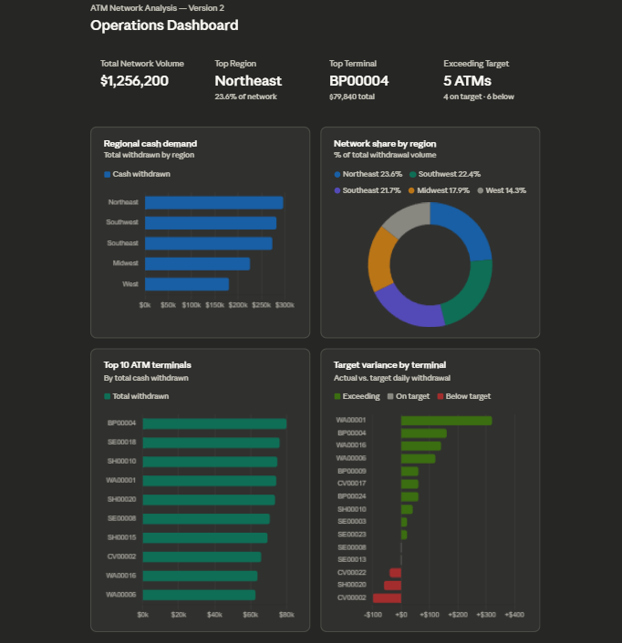

# 📊 ATM Network Analysis — Version 2

SQL Portfolio Project | ATM Operations & Data Analysis
**Author:** Sean Codner

---

## 📌 Project Overview

This project analyzes ATM network performance using SQL, focusing on:

- Cash demand
- Terminal performance
- Operational efficiency

The analysis simulates a real-world ATM network environment, where decisions around **cash allocation, servicing frequency, and terminal classification** are driven by data.

### 🎯 Objectives

- Identify high-performing and underperforming ATMs
- Analyze regional cash demand patterns
- Evaluate ATM performance against daily cash targets
- Support operational decision-making using data

---

## 🧱 Database Structure

The dataset is modeled using three relational tables joined on `atm_terminal_id` and `region`:

| Table | Description |
|-------|-------------|
| `regional_cash_demand` | Total cash withdrawn by region across the network |
| `highest_withdrawal_atms` | Top performing ATM terminals by total withdrawal volume |
| `cash_target_variance` | Expected vs. actual withdrawal performance per terminal |

---

## ⚠️ Portfolio Classification Note

In this project, **Bank Branded (BB)** and **Portfolio Tier** are treated as separate concepts.

- **Bank Branded (BB)** refers to ATMs placed under a bank brand (e.g., Chase), where the financial institution selects the terminal location.
  👉 This is a **branding and placement decision**, not driven by transaction volume.

- **Portfolio Tier** represents the **operational classification** of an ATM based on usage and transaction activity.

📌 A terminal may be **bank branded while belonging to any performance tier**.

---

## 📊 Portfolio Tier Definitions

| Tier | Description |
|------|------------|
| Iron | Fewer than 100 transactions per month |
| Bronze | ~200–250 transactions per month |
| Silver | ~250–500 transactions per month |
| Gold | ~500–1,000 transactions per month |
| Platinum | More than 1,000 transactions per month |

> Portfolio tiers in this project are modeled to reflect real ATM operational classifications used in live network management.

---

## ❓ Business Questions Answered

| # | Business Question | SQL Technique |
|---|-------------------|---------------|
| 1 | Which regions generate the highest cash demand? | Aggregation + Subquery + % Calculation |
| 2 | Which ATMs are overperforming or underperforming vs. targets? | CASE WHEN + Variance Classification |
| 3 | Which top-volume ATMs are also beating their targets? | Multi-Table JOIN + Filtering |
| 4 | What is each region's share of total network volume? | Subquery + Percentage Calculation |
| 5 | Which location types drive the highest withdrawal volume? | GROUP BY + RANK Window Function |

---

## 🔍 Key SQL Techniques Used

- `JOIN` — combining ATM and transaction data across tables
- `GROUP BY` — aggregating demand and performance metrics
- `CASE WHEN` — classifying ATM performance status
- `WINDOW FUNCTIONS` (`RANK`) — ranking terminals by location type
- `CTEs` — structuring complex multi-step queries
- `Subquery` — calculating dynamic network totals for percentage share
- Aggregations: `SUM`, `AVG`, `ROUND`, `COUNT`

---

## 📊 Analysis, Queries & Results

---

### Query 1 — Regional Cash Demand Ranking

Identifies which regions drive the most total ATM withdrawal volume — used to prioritize cash logistics and vendor scheduling across the network.

```sql
SELECT
    region,
    total_cash_withdrawn_usd,
    ROUND(
        total_cash_withdrawn_usd * 100.0 /
        (SELECT SUM(total_cash_withdrawn_usd) FROM regional_cash_demand), 1
    ) AS pct_of_network
FROM regional_cash_demand
ORDER BY total_cash_withdrawn_usd DESC;
```

**Results:**

| Region    | Total Cash Withdrawn | % of Network |
|-----------|:--------------------:|:------------:|
| Northeast | $296,280             | 23.6%        |
| Southwest | $281,860             | 22.4%        |
| Southeast | $273,000             | 21.7%        |
| Midwest   | $225,160             | 17.9%        |
| West      | $179,900             | 14.3%        |
| **Total** | **$1,256,200**       | **100%**     |

**Operational Insight:** The Northeast leads network volume at 23.6% of total withdrawals. The top 3 regions account for nearly 68% of all cash demand — meaning replenishment resources should be heavily concentrated in the Northeast, Southwest, and Southeast. The West at 14.3% is a candidate for optimized scheduling to reduce operational costs.

---

### Query 2 — ATM Target Variance Classification

Compares expected vs. actual withdrawal performance per terminal using `CASE WHEN` logic — classifying each ATM as exceeding, meeting, or falling below its daily cash target.

```sql
SELECT
    atm_terminal_id,
    region,
    location_type,
    portfolio_tier,
    avg_daily_withdrawal_target,
    actual_avg_withdrawal,
    variance,
    CASE
        WHEN variance > 0  THEN 'EXCEEDING TARGET'
        WHEN variance = 0  THEN 'ON TARGET'
        ELSE                    'BELOW TARGET'
    END AS performance_status
FROM cash_target_variance
ORDER BY variance DESC;
```

**Results:**

| ATM ID  | Region    | Location        | Tier     | Target  | Actual  | Variance | Status              |
|---------|-----------|-----------------|----------|:-------:|:-------:|:--------:|---------------------|
| WA00001 | Northeast | Retail          | Platinum | $14,500 | $14,820 | +$320    | ✅ EXCEEDING TARGET  |
| BP00004 | Northeast | Transit Station | Platinum | $15,800 | $15,960 | +$160    | ✅ EXCEEDING TARGET  |
| WA00016 | Southwest | Retail          | BB       | $12,600 | $12,740 | +$140    | ✅ EXCEEDING TARGET  |
| WA00006 | Southeast | Retail          | BB       | $12,400 | $12,520 | +$120    | ✅ EXCEEDING TARGET  |
| BP00009 | Southeast | Retail          | Standard | $5,400  | $5,460  | +$60     | ✅ EXCEEDING TARGET  |
| SE00008 | Southeast | Bank Branch     | Platinum | $14,100 | $14,100 | $0       | ➡️ ON TARGET        |
| SE00013 | Midwest   | Mall            | Standard | $7,900  | $7,900  | $0       | ➡️ ON TARGET        |
| SH00020 | Southwest | Airport         | BB       | $14,750 | $14,700 | -$60     | ⚠️ BELOW TARGET     |
| CV00022 | West      | Mall            | Standard | $7,700  | $7,660  | -$40     | ⚠️ BELOW TARGET     |
| CV00002 | Northeast | Bank Branch     | BB       | $13,250 | $13,140 | -$100    | ⚠️ BELOW TARGET     |

**Operational Insight:** WA00001 in the Northeast shows the highest positive variance at +$320 above its daily target. This terminal's cash loading target should be revised upward and replenishment frequency increased. CV00002 is the network's largest underperformer at -$100 below target despite being a Bank Branch location — a potential candidate for placement review or tier reclassification.

---

### Query 3 — Top Performers Exceeding Targets (Multi-Table JOIN)

Joins the highest withdrawal ATMs with their target variance data to identify machines that are both **high-volume AND beating their daily targets** — the most operationally critical terminals in the network.

```sql
SELECT
    h.atm_terminal_id,
    h.region,
    h.location_type,
    h.portfolio_tier,
    h.total_cash_withdrawn,
    c.avg_daily_withdrawal_target,
    c.actual_avg_withdrawal,
    c.variance
FROM highest_withdrawal_atms h
JOIN cash_target_variance c
    ON h.atm_terminal_id = c.atm_terminal_id
WHERE c.variance >= 0
ORDER BY h.total_cash_withdrawn DESC;
```

**Results:**

| ATM ID  | Region    | Location        | Total Withdrawn | Daily Target | Actual Daily | Variance |
|---------|-----------|-----------------|:---------------:|:------------:|:------------:|:--------:|
| BP00004 | Northeast | Transit Station | $79,840         | $15,800      | $15,960      | +$160    |
| SH00010 | Southeast | Airport         | $74,720         | $14,900      | $14,940      | +$40     |
| WA00001 | Northeast | Retail          | $74,140         | $14,500      | $14,820      | +$320    |
| SE00008 | Southeast | Bank Branch     | $70,540         | $14,100      | $14,100      | $0       |
| SH00015 | Midwest   | Bank Branch     | $69,280         | $13,850      | $13,860      | $0       |
| WA00016 | Southwest | Retail          | $63,680         | $12,600      | $12,740      | +$140    |
| WA00006 | Southeast | Retail          | $62,560         | $12,400      | $12,520      | +$120    |

**Operational Insight:** BP00004 — a Platinum Transit Station in the Northeast — is the single most critical terminal in the network. It leads all ATMs in total cash withdrawn at $79,840 while also exceeding its daily target by $160. This machine should be the first priority for replenishment scheduling and cash level monitoring across the entire network.

---

### Query 4 — Regional Market Share (Subquery)

Calculates each region's percentage contribution to total network withdrawal volume using a subquery to derive the network total dynamically — avoiding hardcoded values.

```sql
SELECT
    r.region,
    r.total_cash_withdrawn_usd,
    ROUND(
        r.total_cash_withdrawn_usd * 100.0 /
        (SELECT SUM(total_cash_withdrawn_usd) FROM regional_cash_demand), 1
    ) AS network_share_pct
FROM regional_cash_demand r
ORDER BY network_share_pct DESC;
```

**Results:**

| Region    | Total Withdrawn | Network Share |
|-----------|:---------------:|:-------------:|
| Northeast | $296,280        | 23.6%         |
| Southwest | $281,860        | 22.4%         |
| Southeast | $273,000        | 21.7%         |
| Midwest   | $225,160        | 17.9%         |
| West      | $179,900        | 14.3%         |

**Operational Insight:** The West region controls just 14.3% of network volume — the lowest market share by a significant margin. This signals an opportunity to either reduce cash replenishment frequency or investigate whether lower-performing terminals need relocation to higher-traffic sites. Conversely, Northeast and Southwest together control 46% of total volume and should receive priority operational attention.

---

### Query 5 — Location Type Performance Ranking (Window Function)

Ranks withdrawal performance by location type to identify which venue categories drive the most ATM activity — directly informing future ATM placement and investment strategy.

```sql
SELECT
    location_type,
    COUNT(DISTINCT atm_terminal_id)     AS atm_count,
    SUM(total_cash_withdrawn)           AS total_withdrawn,
    ROUND(AVG(total_cash_withdrawn), 0) AS avg_per_atm,
    RANK() OVER (
        ORDER BY SUM(total_cash_withdrawn) DESC
    ) AS location_rank
FROM highest_withdrawal_atms
GROUP BY location_type;
```

**Results:**

| Location Type   | ATM Count | Total Withdrawn | Avg Per ATM | Rank |
|-----------------|:---------:|:---------------:|:-----------:|:----:|
| Bank Branch     | 3         | $212,300        | $70,767     | #1   |
| Retail          | 3         | $200,380        | $66,793     | #2   |
| Airport         | 2         | $148,180        | $74,090     | #3   |
| Transit Station | 1         | $79,840         | $79,840     | #4   |

**Operational Insight:** Bank Branch locations generate the highest **total** withdrawal volume across the top-performing ATM set. However, Transit Station ATMs average the highest withdrawal volume **per machine** at $79,840 — making them the most individually productive terminal type in the network. Future placement strategy should prioritize transit and airport locations to maximize per-unit cash performance.

---

## 🧠 Operational Thinking — Tier Reclassification Opportunity

Several Standard-tier ATMs in this dataset demonstrated sustained daily withdrawal activity above their expected targets.

**Recommendation:** Evaluate these units for potential tier upgrades (e.g., Standard → BB or Platinum), which would allow:

- Higher cash load limits
- Improved servicing schedules
- Reduced risk of cash outages during peak demand periods

This kind of data-driven reclassification is a direct output of variance monitoring — exactly the type of analysis performed by network operations teams managing large ATM portfolios.

---

## 🛠️ Assumptions & Notes

- ATM withdrawals are standardized to **$20 denominations**
- Data represents **aggregated ATM activity**, not individual transactions
- Portfolio tiers are **modeled classifications** reflecting real operational frameworks
- Bank Branded designation is independent of portfolio tier and performance level

---

## 📂 Repository Contents

| File | Description |
|------|-------------|
| `analysis.sql` | Full SQL analysis — all 5 queries |
| `regional_cash_demand.csv` | Total withdrawal volume by region |
| `highest_withdrawal_atms.csv` | Top 10 ATM terminals by total cash withdrawn |
| `cash_target_variance.csv` | Daily target vs. actual performance per terminal |
| `atm_network_dashboard.png` | Dashboard visualization |

---

## 🚀 Future Improvements

- Add time-series analysis (daily / weekly trends)
- Incorporate outage and servicing data
- Build an interactive dashboard (Tableau / Power BI)
- Add predictive modeling for cash demand forecasting
- Expand vendor performance analysis (Brinks, Loomis, Garda)

---

## 💼 Business Value

This project demonstrates how SQL can be used to:

- Translate raw ATM network data into operational decisions
- Identify cash replenishment priorities before service failures occur
- Support tier reclassification and placement strategy
- Quantify regional demand concentration and network dependency risk

---

## 📈 Dashboard



---

## 👤 About the Author

**Sean Codner** — Operations & Data Analyst
Houston, Texas

Background in ATM network operations at **Cardtronics**, supporting performance monitoring across a network of 45,000+ machines nationwide. This project applies that operational experience to a structured multi-table SQL analysis framework.

**Connect:**
- 🔗 [LinkedIn](https://linkedin.com/in/sean-codner-aa60822b)
- 💻 [GitHub](https://github.com/SEANSKIDATA)

---

*Tools used: MySQL · SQL · Google Sheets · GitHub*
